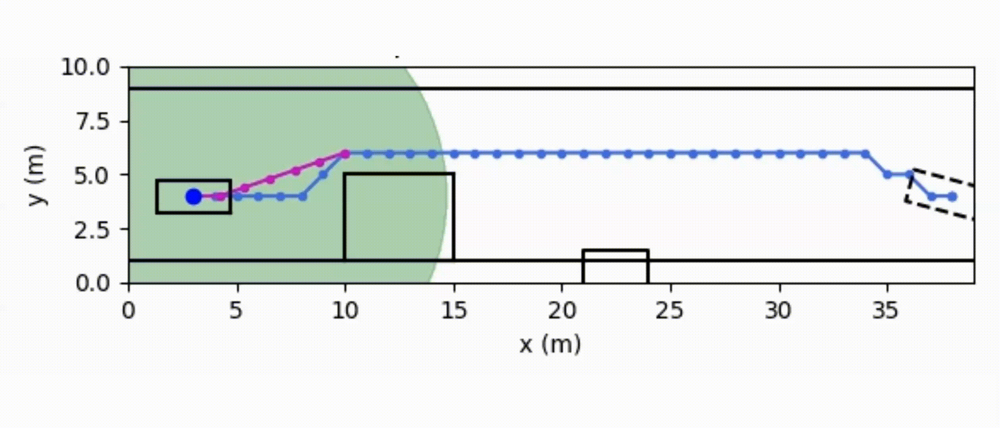
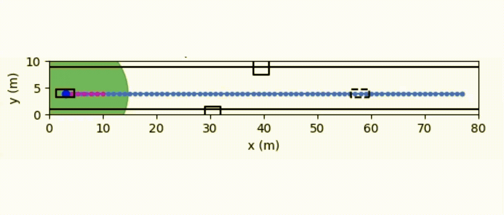
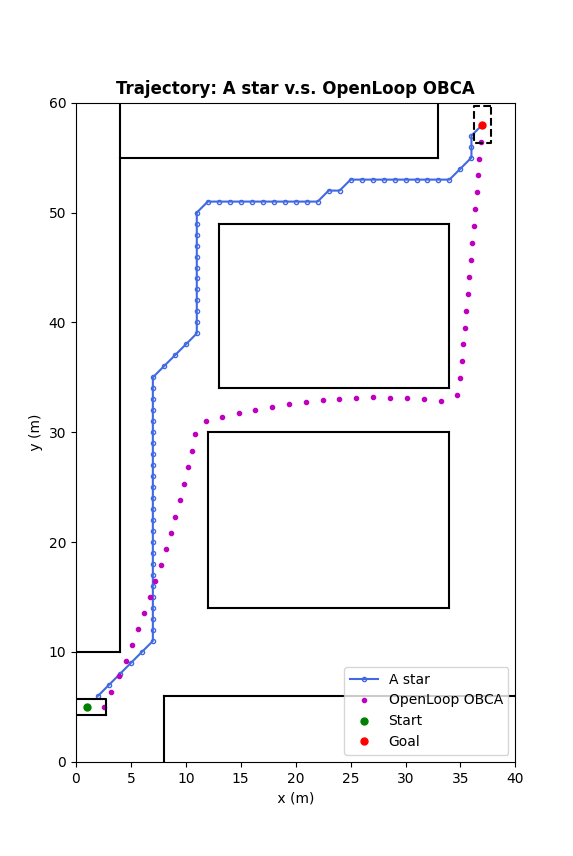

# Vehicle_Motion_Planning_with_Obstacles_Avoidance_using_MPC

## Introduction
This project aims to address static and dynamic obstacle avoidance challenges in autonomous systems through the utilization of the Optimization-Based Collision Avoidance (OBCA) algorithm and a lidar sensor.

Our approach generates collision-free trajectories using a hierarchical Path Planning method. Initially, a coarse path is planned using the A* algorithm, and this path is further optmized using OBCA algorithm. In order to handle unexpected dynamic obstacles, we simulate a simplified lidar system with a circular range. When an obstacle enters the lidar's detection range, it is taken into account during the planning process, allowing for dynamic updates to the trajectory based on predicted movements of the obstacles.

  

You can find more information about the project here: <a href="ME231_Team9_Project_Technical_Report.pdf" target="_blank">Design of Autonomous Delivery Using Time Optimal MPC Controller with Obstacle Avoidance.</a>

## Comparsion of different Method
The following image and animation show the comparsion of using different path planning method, includes
- A*
- open loop OBCA
- Hierarchical Path Planning (A* + OBCA)

The reason for employing a hierarchical path planning approach, combining A* and OBCA, is to reduce execution time. Without a reference path, OBCA alone may require a significant amount of time to find a feasible solution. In the following scenario, the execution time for A* is less than 0.004 seconds, while open-loop OBCA takes approximately 1.8 seconds. This comparison shows that A* can be significantly faster than OBCA.

To achieve responsive and efficient motion planning, we have discovered that utilizing A* to generate a reference path and optimizing the planning with time-optimal OBCA in a shorter time horizon yields superior results. This approach enables faster response times while still leveraging the benefits of OBCA's collision avoidance capabilities.
Planning Method Comparsion             |  Hierarchical Path Planning
:-------------------------:|:-------------------------:
  |  

## Reference
1. Xiaojing Zhang, Alexander Liniger, Francesco Borrelli. *Optimization-Based Collision Avoidance* (2017).

