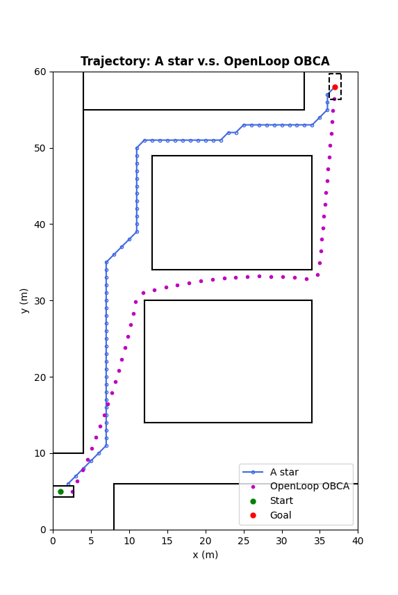

# Vehicle_Motion_Planning_with_Obstacles_Avoidance_using_MPC
Motion Planning for Vehicle with Static and Dynamic Obstacle Avoidance using Optimal Based Collision Avoidance (OBCA).

|||
|:-:|:-:|

Solarized dark             |  Solarized Ocean
:-------------------------:|:-------------------------:
  |  
